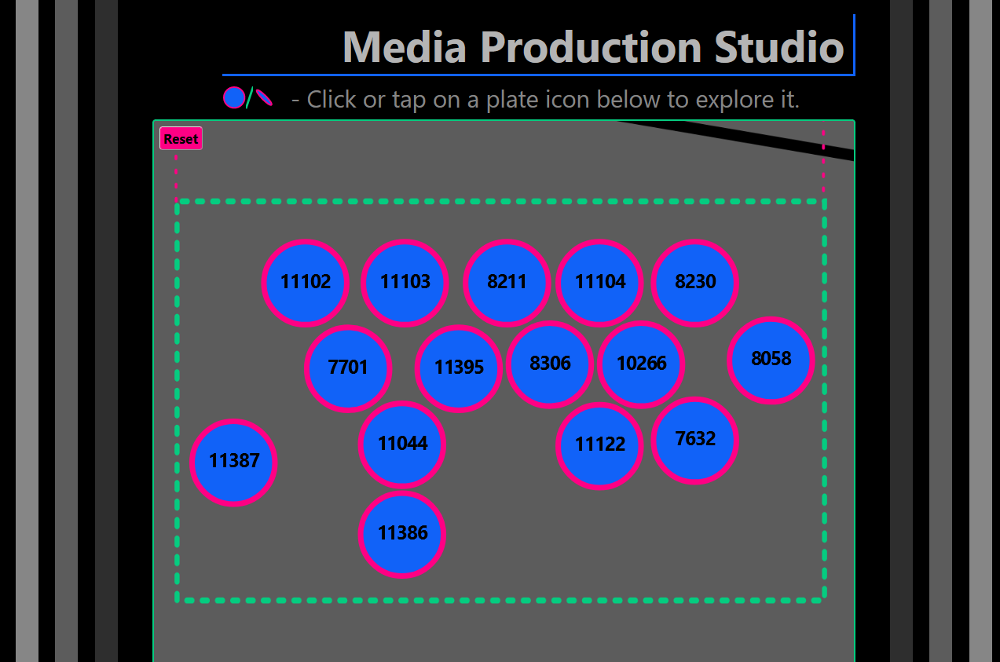

# **Galactic-Ping-Pong**
Project Initiated: 2022-01-17<br/>
Updated: 2022-04-23

## **Deployed Project Link**
https://codingmoore.github.io/Galactic-Ping-Pong/
<br/>

## **Project Description**
This is a mobile friendly companion webpage for visitors to the "Galactic-Ping-Pong" art show (Artwork by [Katheryn Cellerini Moore](https://kmoostudios.com)).

This mobile friendly, themed webpage allows users to select which gallery they are currently inside, and provides an interactive gallery map to aid in navigating the space.  These maps are touch-friendly, and allow the user to pan and zoom to get more information about a specific area of the art installation. The icons on the gallery maps represent physical objects in the spaces called "[SDSS Plates](https://voyages.sdss.org/preflight/sdss-plates/)" (Sloan Digital Sky Survey Plates).

SDSS Plates are 31" diameter, 1/8" think aluminum disks, each with 640-1000 small holes drilled into them. Each hole corresponds to a real galaxy, star, or quasar.  The scientists of the Sloan Digital Sky Survey mount these plates into extremely large telescopes, allowing them to make accurate scientific observations about each object (as represented by a plate hole).  The scientist can use this collective data to help map out the universe.

While in the art galleries, a visitor can use this webpage to find the specific SDSS Plate that is in front of them.  When it is selected, a new browser window will open, containing a touch-friendly, interactive representation of the plate.  The visitor can then pan and zoom around the digital version of the plate and select any of the 640-1000 holes (astronomical objects).  When any hole is selected, the visitor is taken to the SDSS website and presented with scientific data specific to that galaxy, star, or quasar.

<br/>

## **Screenshots**
<br/>

&emsp;
<br/>

&emsp;
<br/>

&emsp;

## **Required for Use**
* A mobile or desktop browser that can run HTML5.

<br/>

## **Installation Instructions**
### **Option 1** (Live Site)
To use the live (hosted) version of this project, simply follow this link.
https://codingmoore.github.io/Galactic-Ping-Pong/

### **Option 2** (direct download)

Copy and paste the following GitHub project link into your web browser's url bar and hit enter/return.

https://github.com/CodingMoore/Galactic-Ping-Pong

Download a .zip copy the repository by clicking on the large green "Code" button near the upper right corner of the screen.

Right click the .zip file and extract (unzip) it's contents.

Open the unzipped folder/files using Visual Studio Code, or similar source code editing program.

Use your Source Code Editor to run the project locally. In Visual Studio Code, this is done by right clicking on the "index.html" file (found in the project's root directory) and then selecting "Open with Live Server".  The project should automatically open using your computer's default web browser.


### **Option 3** (via git console/terminal)

Open your Git enabled terminal/console and navigate to a directory that you wish to download this project to.

Type the following line of code into your terminal/console to automatically download the project to your current directory and hit return/enter.
```
git clone https://github.com/CodingMoore/Galactic-Ping-Pong
```

Once the project has finished downloading, navigate to the root directory of the project in the terminal/console, and type "code ." and then hit return/enter.

The project should automatically launch using your default source code editor.

Use your Source Code Editor to run the project locally. In Visual Studio Code, this is done by right clicking on the "index.html" file (found in the project's root directory) and then selecting "Open with Live Server".  The project should automatically open using your computer's default web browser.
<br/>

## **Known Bugs**
There are no known bugs at this time.
<br/>

## **Planned Updates**
As this project was created for a specific art show which closes in April 2022, it will likely not receive any feature updates after this point.
<br/>

## **Technology Used**

__Programming Software:__<br/>
* HTML<br/>
* JavaScript<br/>
* CSS<br/>
* jQuery<br/>
* Bootstrap<br/>
* [panzoom (library)](https://github.com/timmywil/panzoom)<br/>
<br/>

__Other Software:__<br/>
* [Affinity Designer](https://affinity.serif.com/en-us/designer/) - Used to create the gallery maps and plate icons (.svg files). 

<br/>

## **Authors and Contributors**
**Authored by:** Randel Moore

<br/>

## **Acknowledgements**
**Plate Background Images Credit:** [Sloan Digital Sky Survey](https://www.sdss.org/)<br/>
**Plate Data Credit:** [Sloan Digital Sky Survey](https://www.sdss.org/)

<br/>

## **Contact**
CodingMoore@gmail.com

<br/>

## **License**

GPLv3

Copyright © 2022 Randel Moore